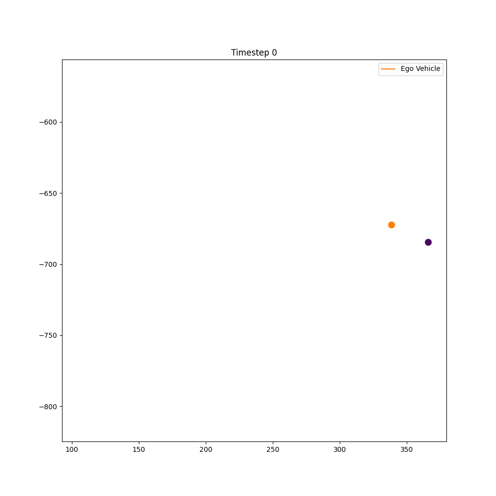

# Vehicle Motion Forecasting

This repository contains the code for a Vehicle Motion Forecasting Competition in Spring 2025 for UCSD's 251B: Deep Learning course.

- Public Score Ranking: <b>13th</b> out of 68 teams
- Private Score Ranking: <b>14th</b> out of 68 teams

## Overview

The competition involved forecasting the future positions of agents based on their past positions and velocities. The dataset is based on the <b>Argoverse 2 Motion Forecasting Dataset</b>. Download the train and test data from here: https://drive.google.com/drive/folders/1HvjwglXTPKEtWlpFFtbiPctbRfHmcKNp

The training set is of shape <b>(10000, 50, 110, 6)</b>. This means That there are 10,000 training scenes, each scene contains 50 agents' trajectories over 110 time steps, and each time step has 6 dimensions. The 6 dimensions are: 
- position_x
- position_y
- velocity_x
- velocity_y
- heading
- object_type

The test set input has shape <b>(2100, 50, 50, 6)</b>.

<b>The task is to predict the ego vehicle (agent index 0)'s trajectory. Given the first 50 time steps (5 seconds) to predict the next 60 time steps (6 seconds).</b>

Here is an example of 1 scene:

## Models 

The types of models we trained were Linear Regression, Convolutional Neural Networks, and LSTMs. Please see the model architectures in `/models` directory and the experiments in the `/experiments` directory.

## Results

The <b>LSTM + Attention</b> model performed the best. Here are the plotted training loss and validation loss curves for the models we tried:

